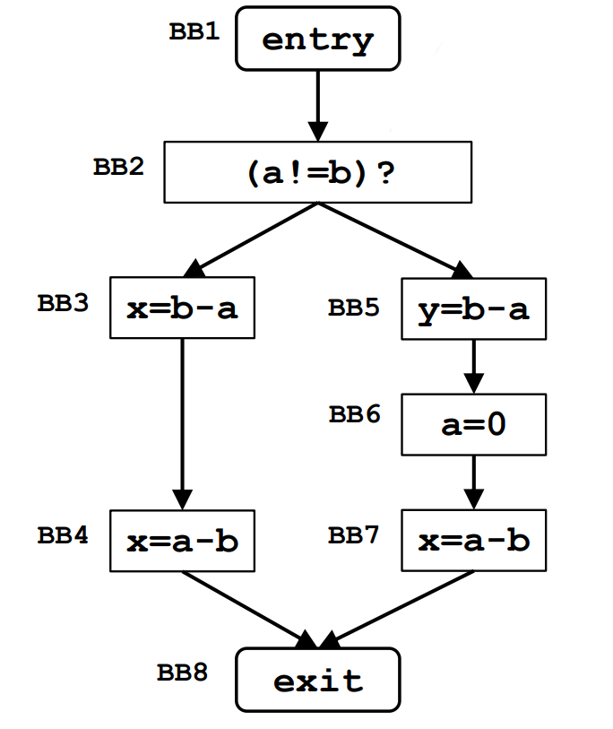
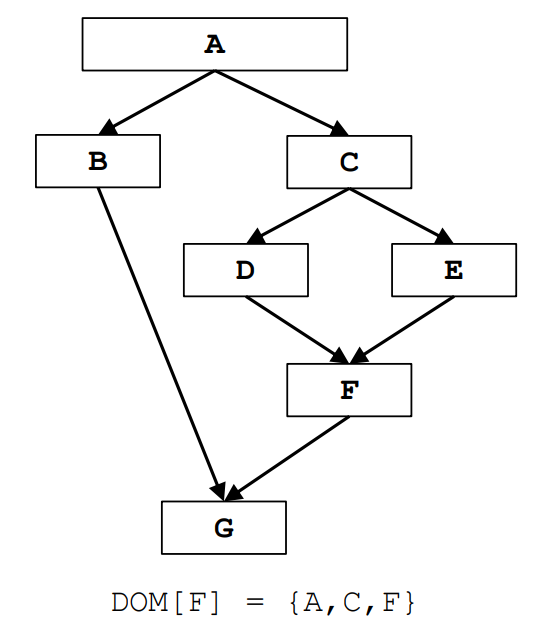
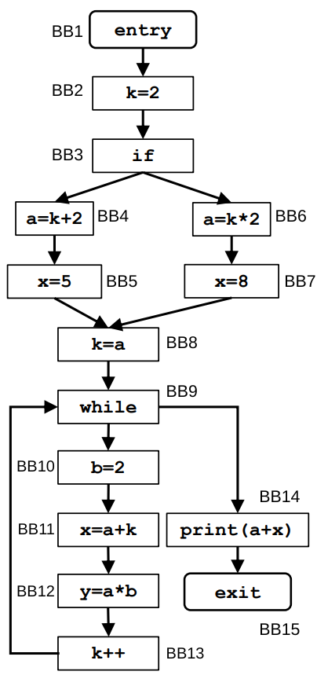

## Very Busy Expression Analysis

### **VBE Framework**

| **Component**                 | VBE                                                                                               |
| ----------------------------- | ------------------------------------------------------------------------------------------------- |
| **Domain**                    | Sets of expressions                                                                               |
| **Direction**                 | Backward: $\text{in}[b]$ = $f_b(\text{out}[b])$ out[b] = $\wedge \text{in}(\text{succ}[b])$ |
| **Transfer Function**         | $f_b(x) = \text{Gen}[b] \cup (\text{in}[b] - \text{Kill}[b])$                                     |
| **Meet Operation** ($\wedge$) | $\cap$                                                                                            |
| **Boundary Condition**        | $\text{in[entry]} = \emptyset$                                                                    |
| **Initial Interior Points**   | $\text{in[b]} = \mathcal{U}$                                                                      |

### Very Busy Expressions (VBE) - Descrizione del Framework

- **Domain**: L'insieme di tutte le espressioni aritmetiche (o logiche) che compaiono all'interno del CFG.

---

- **Direction**: **Backward**. Perché un'espressione possa essere considerata *Very Busy* in un punto $p$ se verrà sicuramente valutata in *futuro* lungo tutti i percorsi possibili prima che i suoi operandi vengano ridefiniti. Di conseguenza, le informazioni devono propagarsi dalla fine del programma verso l'inizio.

---

- **Transfer Function**: $f_b(x) = \text{Gen}[b] \cup (in[b] - \text{Kill}[b])$, un'espressione è *Very Busy* prima del blocco se viene generata all'interno del blocco stesso ($\text{Gen}[b]$), oppure se era richiesta all'uscita ($x$) e nessun operando è stato modificato o "ucciso" durante l'esecuzione del blocco ($\text{Kill}[b]$).

---

- **Meet Operation ($\wedge$)**: **Intersezione ($\cap$)**. un'espressione è Very Busy all'uscita di un blocco solo se viene calcolata in tutti i percorsi futuri possibili. L'intersezione serve proprio a questo: se un'espressione non compare all'inizio di ogni blocco successivo, viene scartata

---

- **Boundary Condition**: $\text{out}[\text{exit}] = \emptyset$.

---

- **Initial Interior Points**: $\text{in}[b] = \mathcal{U}$ Inizializziamo ogni blocco dicendo che contiene tutte le espressioni possibili, sarà poi l'intersezione a filtrare quelle busy.

---

### **VBE Table**

| **Basic Block** | **In[b]**                  | **Out[b]**            |
| --------------- | -------------------------- | --------------------- |
| **BB1 (entry)** | $\lbrace b-a \rbrace$      | $\lbrace b-a \rbrace$ |
| **BB2**         | $\lbrace b-a \rbrace$      | $\lbrace b-a \rbrace$ |
| **BB3**         | $\lbrace b-a, a-b \rbrace$ | $\lbrace a-b \rbrace$ |
| **BB4**         | $\lbrace a-b \rbrace$      | $\emptyset$           |
| **BB5**         | $\lbrace b-a \rbrace$      | $\emptyset$           |
| **BB6**         | $\emptyset$                | $\lbrace a-b \rbrace$ |
| **BB7**         | $\lbrace a-b \rbrace$      | $\emptyset$           |
| **BB8 (exit)**  | $\emptyset$                | $\emptyset$           |

---

## Dominator Analysis

### **DA Framework**

| **Component**                 | DA                                                                                                        |
| ----------------------------- | --------------------------------------------------------------------------------------------------------- |
| **Domain**                    | Sets of Basic Blocks                                                                                      |
| **Direction**                 | Forward: $\text{out}[b]$ = $f_b(\text{in}[b])$ $\text{in}[b]$ = $\wedge \text{out}(\text{pred}[b])$ |
| **Transfer Function**         | $f_b(x) =  x \cup \lbrace b \rbrace$                                                                      |
| **Meet Operation** ($\wedge$) | $\cap$                                                                                                    |
| **Boundary Condition**        | $\text{out[entry]} = \emptyset$                                                                           |
| **Initial Interior Points**   | $\text{out[b]} = \mathcal{U}$                                                                             |

### Dominator Analysis (DA) - Descrizione del Framework

- **Domain**: L'insieme di tutti i Basic Blocks.

---

- **Direction**: **Forward**. E'necessario conoscere i predecessori di un blocco per stabilirne i dominatori, quindi il flusso va "dall'alto verso il basso".

---

- **Transfer Function**: $f_b(x) = x \cup \{b\}$, La funzione prende l'insieme dei dominatori che arrivano all'ingresso del blocco $b$ e vi aggiunge il blocco corrente $\{b\}$ all'uscita ($\text{out}[b]$).

---

- **Meet Operation ($\wedge$)**: **Intersezione ($\cap$)**. Intersezione permette di controllare che ogni percorso contenga un determinato blocco per poterlo definire dominatore.

---

- **Boundary Condition**: $\text{out}[\text{entry}] = \emptyset$.

---

- **Initial Interior Points**: $\text{out}[b] = \mathcal{U}$. Inizializziamo l'uscita di ogni blocco interno dicendo che, ipoteticamente, è dominata da tutti i blocchi del programma. Sara' poi l'intersezione a filtrare.

### **DA Table**

| **Basic Block** | **In[b]**              | **Out[b]**                |
| --------------- | ---------------------- | ------------------------- |
| **A (entry)**   | $\emptyset$            | $\lbrace A \rbrace$       |
| **B**           | $\lbrace A \rbrace$    | $\lbrace A, B \rbrace$    |
| **C**           | $\lbrace A \rbrace$    | $\lbrace A, C \rbrace$    |
| **D**           | $\lbrace A, C \rbrace$ | $\lbrace A, C, D \rbrace$ |
| **E**           | $\lbrace A, C \rbrace$ | $\lbrace A, C, E \rbrace$ |
| **F**           | $\lbrace A, C \rbrace$ | $\lbrace A, C, F \rbrace$ |
| **G (exit)**    | $\lbrace A \rbrace$    | $\lbrace A, G \rbrace$    |

---

## Constant Propagation

### **CP Framework**

| **Component**                 | CP                                                                                                        |
| ----------------------------- | --------------------------------------------------------------------------------------------------------- |
| **Domain**                    | Sets of pairs $(var, val)$                                                                                |
| **Direction**                 | Forward: $\text{out}[b]$ = $f_b(\text{in}[b])$ $\text{in}[b]$ = $\wedge \text{out}(\text{pred}[b])$ |
| **Transfer Function**         | $f_b(x) =  \text{Gen}[b] \cup (\text{in}[b] - \text{Kill}[b])$                                            |
| **Meet Operation** ($\wedge$) | $\cap$                                                                                                    |
| **Boundary Condition**        | $\text{out[entry]} = \emptyset$                                                                           |
| **Initial Interior Points**   | $\text{out[b]} = \mathcal{U}$                                                                             |

### Constant Propagation (CP) - Descrizione del Framework

- **Domain**: L'insieme di coppie $(var, val)$, dove $var$ è una variabile del programma (es. $a, b, k, x, y$) e $val$ è il valore costante intero ad essa associato.

---

- **Direction**: **Forward**. Per sapere se una variabile ha un valore costante in un determinato punto, dobbiamo analizzare la storia dei suoi assegnamenti a partire dall'inizio del programma. Le informazioni si propagano dall'alto verso il basso.

---

- **Transfer Function**: $f_b(x) = \text{Gen}[b] \cup (x - \text{Kill}[b])$.

---

- **Meet Operation ($\wedge$)**: **Intersezione ($\cap$)**. È un'analisi di tipo "Must": una variabile è considerata costante all'ingresso di un blocco solo se mantiene lo *stesso identico* valore costante lungo **tutti** i percorsi che convergono in quel punto.

---

- **Boundary Condition**: $\text{out}[\text{entry}] = \emptyset$.

---

- **Initial Interior Points**: $\text{out}[b] = \mathcal{U}$ Inizializziamo ipoteticamente le uscite dei blocchi interni dicendo che contengono ogni possibile associazione costante. Sara' poi l'intersezione a "tenere" le sole variabili davvero costanti in entrambi i percorsi

### **CP Table – First Iteration**

| **Basic Block** | **In[b]**                                                | **Out[b]**                                               |
| --------------- | -------------------------------------------------------- | -------------------------------------------------------- |
| **BB1 (entry)** | $\emptyset$                                              | $\emptyset$                                              |
| **BB2**         | $\emptyset$                                              | $\lbrace (k, 2) \rbrace$                                 |
| **BB3**         | $\lbrace (k, 2) \rbrace$                                 | $\lbrace (k, 2) \rbrace$                                 |
| **BB4**         | $\lbrace (k, 2) \rbrace$                                 | $\lbrace (k, 2), (a, 4) \rbrace$                         |
| **BB5**         | $\lbrace (k, 2), (a, 4) \rbrace$                         | $\lbrace (k, 2), (a, 4), (x, 5) \rbrace$                 |
| **BB6**         | $\lbrace (k, 2) \rbrace$                                 | $\lbrace (k, 2), (a, 4) \rbrace$                         |
| **BB7**         | $\lbrace (k, 2), (a, 4) \rbrace$                         | $\lbrace (k, 2), (a, 4), (x, 8) \rbrace$                 |
| **BB8**         | $\lbrace (k, 2), (a, 4) \rbrace$                         | $\lbrace (k, 4), (a, 4) \rbrace$                         |
| **BB9**         | $\lbrace (k, 4), (a, 4) \rbrace$                         | $\lbrace (k, 4), (a, 4) \rbrace$                         |
| **BB10**        | $\lbrace (k, 4), (a, 4) \rbrace$                         | $\lbrace (k, 4), (a, 4), (b, 2) \rbrace$                 |
| **BB11**        | $\lbrace (k, 4), (a, 4), (b, 2) \rbrace$                 | $\lbrace (k, 4), (a, 4), (b, 2), (x, 8) \rbrace$         |
| **BB12**        | $\lbrace (k, 4), (a, 4), (b, 2), (x, 8) \rbrace$         | $\lbrace (k, 4), (a, 4), (b, 2), (x, 8), (y, 8) \rbrace$ |
| **BB13**        | $\lbrace (k, 4), (a, 4), (b, 2), (x, 8), (y, 8) \rbrace$ | $\lbrace (k, 5), (a, 4), (b, 2), (x, 8), (y, 8) \rbrace$ |
| **BB14**        | $\lbrace (k, 4), (a, 4) \rbrace$                         | $\lbrace (k, 4), (a, 4) \rbrace$                         |
| **BB15 (exit)** | $\lbrace (k, 4), (a, 4) \rbrace$                         | $\lbrace (k, 4), (a, 4) \rbrace$                         |

### **CP Table – Second Iteration**

| **Basic Block** | **In[b]**                                | **Out[b]**                               |
| --------------- | ---------------------------------------- | ---------------------------------------- |
| **BB1 (entry)** | $\emptyset$                              | $\emptyset$                              |
| **BB2**         | $\emptyset$                              | $\lbrace (k, 2) \rbrace$                 |
| **BB3**         | $\lbrace (k, 2) \rbrace$                 | $\lbrace (k, 2) \rbrace$                 |
| **BB4**         | $\lbrace (k, 2) \rbrace$                 | $\lbrace (k, 2), (a, 4) \rbrace$         |
| **BB5**         | $\lbrace (k, 2), (a, 4) \rbrace$         | $\lbrace (k, 2), (a, 4), (x, 5) \rbrace$ |
| **BB6**         | $\lbrace (k, 2) \rbrace$                 | $\lbrace (k, 2), (a, 4) \rbrace$         |
| **BB7**         | $\lbrace (k, 2), (a, 4) \rbrace$         | $\lbrace (k, 2), (a, 4), (x, 8) \rbrace$ |
| **BB8**         | $\lbrace (k, 2), (a, 4) \rbrace$         | $\lbrace (k, 4), (a, 4) \rbrace$         |
| **BB9**         | $\lbrace (a, 4) \rbrace$                 | $\lbrace (a, 4) \rbrace$                 |
| **BB10**        | $\lbrace (a, 4) \rbrace$                 | $\lbrace (a, 4), (b, 2) \rbrace$         |
| **BB11**        | $\lbrace (a, 4), (b, 2) \rbrace$         | $\lbrace (a, 4), (b, 2) \rbrace$         |
| **BB12**        | $\lbrace (a, 4), (b, 2) \rbrace$         | $\lbrace (a, 4), (b, 2), (y, 8) \rbrace$ |
| **BB13**        | $\lbrace (a, 4), (b, 2), (y, 8) \rbrace$ | $\lbrace (a, 4), (b, 2), (y, 8) \rbrace$ |
| **BB14**        | $\lbrace (a, 4) \rbrace$                 | $\lbrace (a, 4) \rbrace$                 |
| **BB15 (exit)** | $\lbrace (a, 4) \rbrace$                 | $\lbrace (a, 4) \rbrace$                 |

Dopo la seconda iterazione si ottiene la convergenza.

